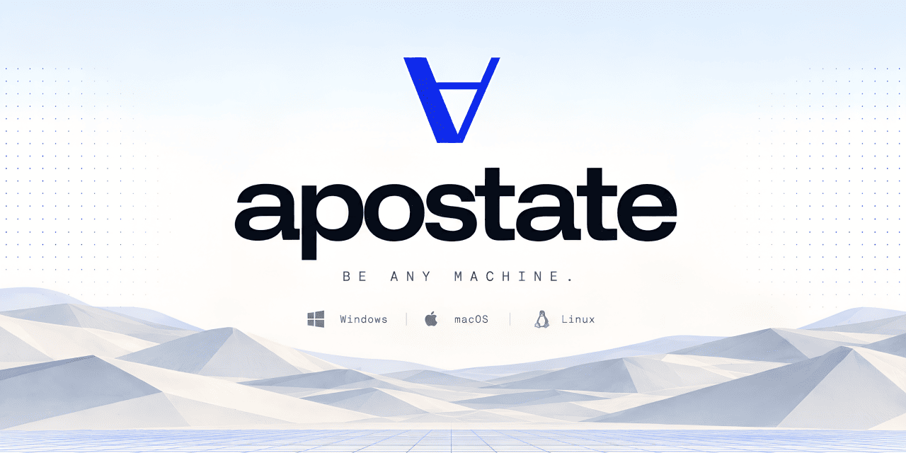
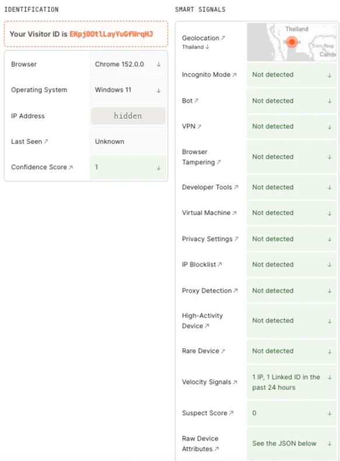
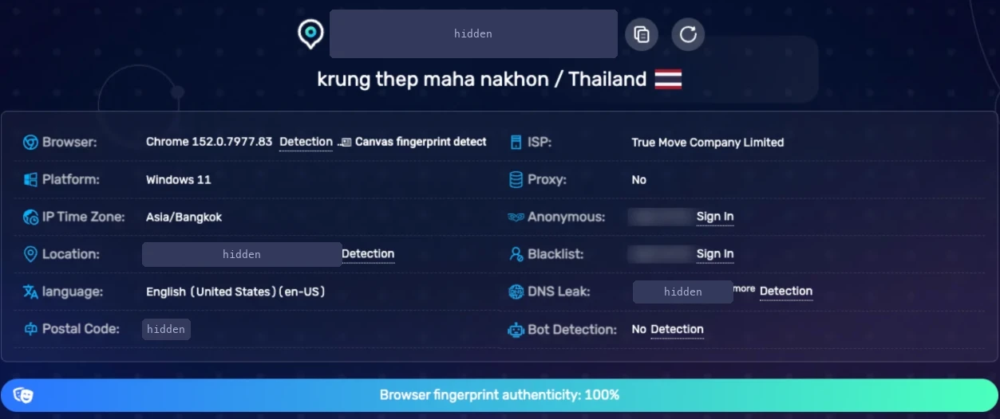
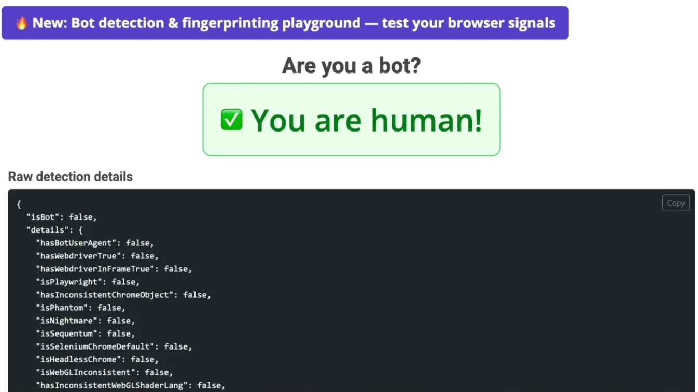
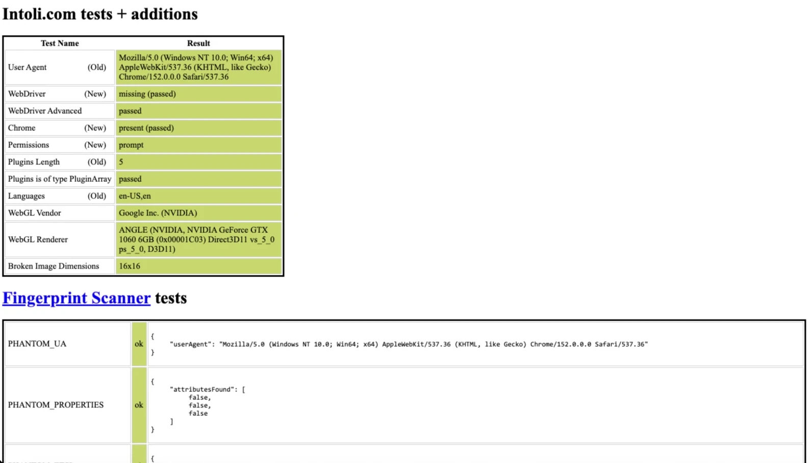

<p align="center">
  
</p>

<h3 align="center">
  <a href="https://apostate.dev">Website</a>
  &nbsp;·&nbsp;
  <a href="https://docs.apostate.dev">Documentation</a>
  &nbsp;·&nbsp;
  <a href="https://docs.apostate.dev/quickstart">Quickstart</a>
  &nbsp;·&nbsp;
  <a href="https://docs.apostate.dev/agents/overview">AI agents</a>
  &nbsp;·&nbsp;
  <a href="https://docs.apostate.dev/testing/results">Test results</a>
</h3>

<p align="center">
  <a href="https://github.com/heretic-tech/apostate/releases/latest"></a>
  <a href="https://pypi.org/project/apostate/"></a>
  <a href="https://www.npmjs.com/package/@heretic-tech/apostate"></a>
  <a href="build/CHROMIUM_VERSION"></a>
  <br>
  <a href="https://github.com/heretic-tech/apostate/actions/workflows/test-suite.yml"></a>
  <a href="https://github.com/heretic-tech/apostate/actions/workflows/check.yml"></a>
  <a href="https://docs.apostate.dev/concepts/personas"></a>
  <a href="LICENSE"></a>
</p>

Apostate is a Chromium build that presents a machine you choose: a Windows,
macOS or Linux persona with a GPU, screen, fonts, voices, locale and timezone
to match. The values are changed in Chromium's C++ where they are produced.
No JavaScript is injected and no DevTools override is set, so workers, iframes
and request headers read the same machine as the page.

Python and Node packages download the browser and launch it through Patchright
or Playwright (Node also drives Puppeteer). An MCP server gives AI agents the
same browser. Free and open source under GPL-3.0, with no account or paid tier.

## Install

```bash
pip install apostate                  # or: npm install @heretic-tech/apostate
apostate install                      # download and verify the browser
apostate fonts install windows        # Linux and macOS hosts, for a Windows persona
```

## Launch

```python
from apostate import launch

browser = launch(fingerprint=42, fingerprint_platform="windows")
page = browser.new_page()
page.goto("https://example.com")
print(page.evaluate("navigator.platform"))   # Win32, on any host
browser.close()
```

```javascript
import { launch } from "@heretic-tech/apostate";

const browser = await launch({ fingerprint: 42, fingerprintPlatform: "windows" });
const page = await browser.newPage();
await page.goto("https://example.com");
console.log(await page.evaluate(() => navigator.platform));
await browser.close();
```

The same seed gives the same machine on every launch and host. A persistent
context keeps a machine with its cookies and logins:
`launch_persistent_context("./profiles/alice")`. `--fingerprint-explain` prints
the machine a launch would present:

```bash
apostate run -- --fingerprint=42 --fingerprint-platform=windows --fingerprint-explain
```

## AI agents

```bash
claude mcp add apostate -- npx -y @heretic-tech/apostate-mcp --platform windows
```

The MCP server gives Claude Code, Codex, Cursor and other MCP clients browser
tools on a headless Apostate browser. See
[AI agents](https://docs.apostate.dev/agents/overview).

## Proof

A Windows persona on an Apple silicon Mac, Chromium 152.0.7977.83, on
2026-09-27. The IP address and location fields are hidden.

<table>
  <tr>
    <td width="50%"></td>
    <td width="50%"><br><br></td>
  </tr>
  <tr>
    <td colspan="2"></td>
  </tr>
</table>

FingerprintJS Pro: suspect score 0. BrowserScan: 100% authentic.
deviceandbrowserinfo.com: human. bot.sannysoft.com: every test passed.

[`tests/`](tests/) checks, on a real browser, that pages read exactly the
machine the browser composed, from every context, with no automation trace,
and records what public detectors say beside control browsers.
[Latest results](https://docs.apostate.dev/testing/results) are generated from
the dated result files in [`tests/results/`](tests/results/).
[Known gaps](https://docs.apostate.dev/known-gaps) lists what a page can still
tell.

## Platforms

| Host | Archive |
| --- | --- |
| Linux x64 | `apostate-152.0.7977.83-linux-x64.tar.zst` |
| Linux arm64 | `apostate-152.0.7977.83-linux-arm64.tar.zst` |
| macOS arm64 | `apostate-152.0.7977.83-macos-arm64.zip` |
| Windows x64 | `apostate-152.0.7977.83-windows-x64.zip` |

Any host can present any persona. Windows personas look most real on an x86
host, macOS personas on a Mac. See
[Choosing a host](https://docs.apostate.dev/concepts/hosts).

## Repository

| Path | Holds |
| --- | --- |
| `patches/` | The Chromium changes, applied in the order `patches/series` lists |
| `build/`, `scripts/` | Pinned build inputs, and a script for every build, release and check step |
| `resources/`, `corpus/`, `capture/` | The catalogue, measured GPU families, captures of real machines and the capture tools |
| `python/`, `npm/`, `mcp/` | The Python package, the Node package and the MCP server |
| `docs/` | The documentation site (Mintlify) |
| `examples/` | Runnable examples: Python, Node, use cases, AI agents, Docker |
| `tests/` | The test suite and its published results |

[Contributing](https://docs.apostate.dev/contributing/overview) covers building
the browser, writing a patch and cutting a release.

## Licence

GPL-3.0. See [LICENSE](LICENSE).
